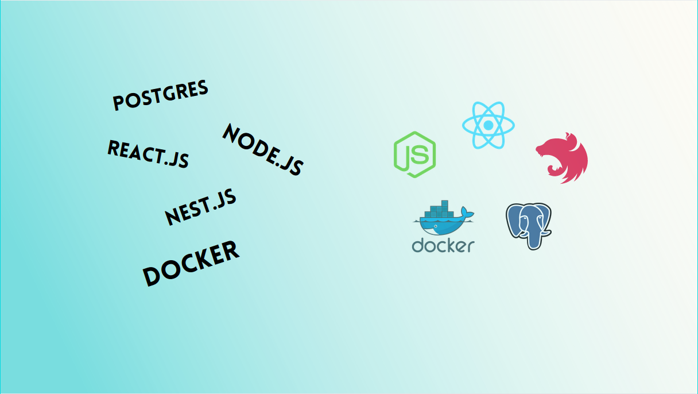

## Postgres - Nest.js - React.js Boilerplate


[](https://www.gnu.org/licenses/gpl-3.0)


### Introduction

This is a Full-stack Dockerized boilerplate.
A vanilla infrastructure made to simplify the develpoment and deploying processes.

#### Stack

- React.js
- Redux
- Node.js
- Nest.js
- Postgres
- Docker

### Prerequisites

Make sure you have the below installed on your machine.

- [x] **Docker** : https://docs.docker.com/engine/install/
- [x] **Docker-Compose** : https://docs.docker.com/compose/install/
- [x] **Node** : https://nodejs.org/en/

### File strcutre

```
project-name
    |
    |---/ client
            |
            |---/ public
            |---/ src
            |
            .env
            .dockerignore
            .gitignore
            Dockerfile
            Dockerfile.dev
            nginx.conf
            tsconfig.json
            package.json
    |
    |---/ database
            .env
            initdb.sql
            .gitignore
    |---/ server
            |
            |---/src
            |
            ormconfig.json
            .dockerignore
            .gitignore
            Dockerfile
            Dockerfile.dev
            nodemon.json
            package.json
            wait-for-it.sh
    |
    |
    docker-compose.yml
    docker-compose-dev.yml
    .prettierrc
    README.md
```

### Quick start

Clone this repo to your local machine

```
git clone https://github.com/nadavpodjarski/postgres-express-react-typescript-boilerplate.git project-name
```

Before we run our container lets calm down our editor and npm install dependecies locally.
For that let's run the following command

```bash
# install server dependencies in the server directory

npm i
```
```bash
# install client dependencies in the client directory

npm i
```

Now Let's check our Demo, for that run the following command in the school directory

```bash
docker-compose --file docker-compose-dev.yml up
```

it will be served on `http://localhost:3000`

## Client

Client has been created with create-react-app and located in `./school/client`

#### Development

In development mode the client will be run in a container built with `./client/Dockerfile.dev` and will be exposed on port 3000, with docker volumes every change thats been saved will be reflected within the running container.

#### Production

In production mode the client build will be created and will run in a container built with `./client/Dockerfile`.
The client build/static-files will be served with nginx server and will be exposed on port 80.

#### Environment Variables

Environment variables are located in `./client/.env` but can be declared into the dockerfile itself under ENV or in the docker compose file under enviornemt property.
**In order to use docker stack deploy** it's needed to use one of the other options and not env_file.

**note that nginx server has a minimalistic configuration**

## Data-base

Postgres database is created with an official postgres image which can be found in docker hub https://hub.docker.com/_/postgres

Environment variables will be located in the docker-compose file.`
and will contain our database credentials :

```
POSTGRES_USER=admin
POSTGRES_PASSWORD=admin
POSTGRES_DB=pern_db
```

Volumes of our database will be located in `./server/database/data`

> Production volume is located in `./server/data/prod` </br>
> Development volume is located in `./server/data/dev`

## Server

Server is located in `./projec-name/server` using express.

#### Development

In development mode the server will run in a container built with `./server/Dockerfile.dev`.
and will be exposed on port 5500 to the "outside" world, with docker volumes and nodemon, every change thats been saved will be refelected within the running container.

#### Production

In production mode the server will run in a container built with `./server/Dockerfile`.
and be exposed on port 5500 only to the docker composer internal services within the same network.
in our case server and client are on the same network "webapp" , hence only the client can communicate with the server, and will do thatthrough the `/api` location. for more locations, its needed to configure them in the `./client/nginx.conf` file.

#### Database connection

Database connection is handled with ormconfig.json that is located at `./server/ormconfig.json`
and will contain postgres credentials to establish connection to our data-base.
Thanks to https://github.com/vishnubob/wait-for-it for the wait-for-it.sh script, we can set that the server image will run only after getting confirmation that postgres container is available.
by that we won't get connection failures due to bad order of docker composing.

## Docker compose

### Development

To establish a development environment, simply run the following command from the project root folder.

```bash
docker-compose --file docker-compose-dev.yml up
```

On save changes in client and server, containers will be automatically updated, no need to restart any servers.
</br>

### Production

To establish production environment, simply run the following command from the root folder.

```bash
docker-compose up
```

This will creates build for both server and client, will serve client build with nginx server on port 80 and will communicate with server on port 5500 in the location /api.

- If you are making changes within the dockerfiles you will need to rebuild them, for that add the --build flag to the docker compose up command.

## Enjoy
# school
Demo project for automating school processes based on Rest API

 # EN:
  Demo project for automating school processes based on Rest API
  
  Technology stack:
  - Front end: React
  - Back-end: Nest.js
  - Web Server: Nginx
  - DMS: PostgreSQL
  - CRM-ORM: TypeORM

 The project implements the automation of an average school of 1-3 degrees in the CIS countries.
 
 The resource has the following features:
  1. Creating a school
  2. Creation of departments - elements of the intrastructural organization of the school
  3. Creation of hierarchical links between deportations of deportations
  4. Creation of professions and positions natural for a certain educational institution
  5. Creation of profiles of employees of the educational institution
  6. Create items and activities that the institution needs
  7. Creation of the scheme of institution.
  8. Dividing the scheme into sectors.
  9. Creating Audiences Based on Robust Sectors on the Establishment Diagram
  10. Create a student profile
  11. Creation of Profiles of parents or responsible guardian.
  12. Creation of primary and secondary classes
  13. Configuration of methodological parameters to simplify the compilation of school methodological documents
  14. Configurator for the schedule of school subjects and activities based on the created entities and parameterized methodological data.
  15. Displaying a set of information based on the definition of the user's role.
 
 # RU:
  Демонстрационный проект автоматизации школьных процессов основанный на Rest API
   
   Technology stack:
   - Front-end:  React
   - Beack-end:  Nest.js
   - Web-Server: Nginx
   - DMS:  	     PostgreSQL
   - CRM-ORM:    TypeORM

  Проект реализует автоматизацию среднестатестической школы 1-3 степеней стран СНГ.
  Ресурз имеет следуюшие фичи:
   1.  Создание школы
   2.  Создание департаментов - елементов внутриструктурной организации школы
   3.  Создание иерархических связей между депортаментами депортаментов 
   4.  Создание професий и должностей закономерных для определленного учебного заведения 
   5.  Создание профилей работников учебного заведения 
   6.  Создания предметов и мероприятий в которых нуждается учереждение 
   7.  Создание схемы учереждения.
   8.  Розбиение схемы секторами.
   9.  Создание аудиторий на основе робитых секторов на схеме учереждения
   10. Создание Профиля учашегося
   11. Создание Профилей родителей или ответственого опекуна.
   12. Создание начальных и средних класов
   13. Конфигурация методологических параметров для упрошения состовления методологических документов школы
   14. Конфигуратор расписания школьных предметов и мероприятиях на основе созданных сушностей и спараметрированных методологических данных.
   15. Отображения совокупности информации на основе определения ролли пользователя.
